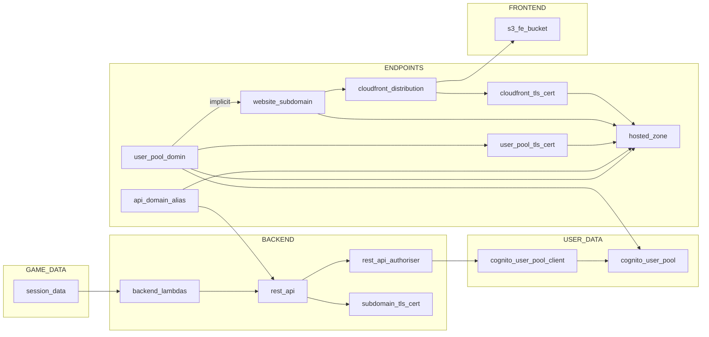

```mermaid
graph LR
    session_data-->backend_lambdas;
    backend_lambdas-->rest_api;
    rest_api-->rest_api_authoriser;
    rest_api-->subdomain_tls_cert;
    rest_api_authoriser-->cognito_user_pool_client;
    cognito_user_pool_client-->cognito_user_pool;
    user_pool_domin-->cognito_user_pool;
    website_subdomain-->cloudfront_distribution;
    cloudfront_distribution-->cloudfront_tls_cert;
    cloudfront_distribution-->s3_fe_bucket;
    user_pool_domin--implicit-->website_subdomain;
    cloudfront_tls_cert-->hosted_zone;
    website_subdomain-->hosted_zone;
    user_pool_domin-->user_pool_tls_cert;
    user_pool_tls_cert-->hosted_zone;
    api_domain_alias-->hosted_zone;
    user_pool_domin-->hosted_zone;
    api_domain_alias-->rest_api;

    subgraph ENDPOINTS
        cloudfront_tls_cert;
        user_pool_tls_cert;
        hosted_zone;
        cloudfront_distribution;
        user_pool_domin;
        api_domain_alias;
        website_subdomain;
    end
    subgraph USER_DATA
        cognito_user_pool_client;
        cognito_user_pool;
    end
    subgraph BACKEND
        rest_api_authoriser;
        rest_api;
        backend_lambdas;
        subdomain_tls_cert;
    end
    subgraph GAME_DATA
        session_data;
    end
    subgraph FRONTEND
        s3_fe_bucket;
    end    
```

TODO: consider using https://diagrams.mingrammer.com/ for this graph (looks cooler)