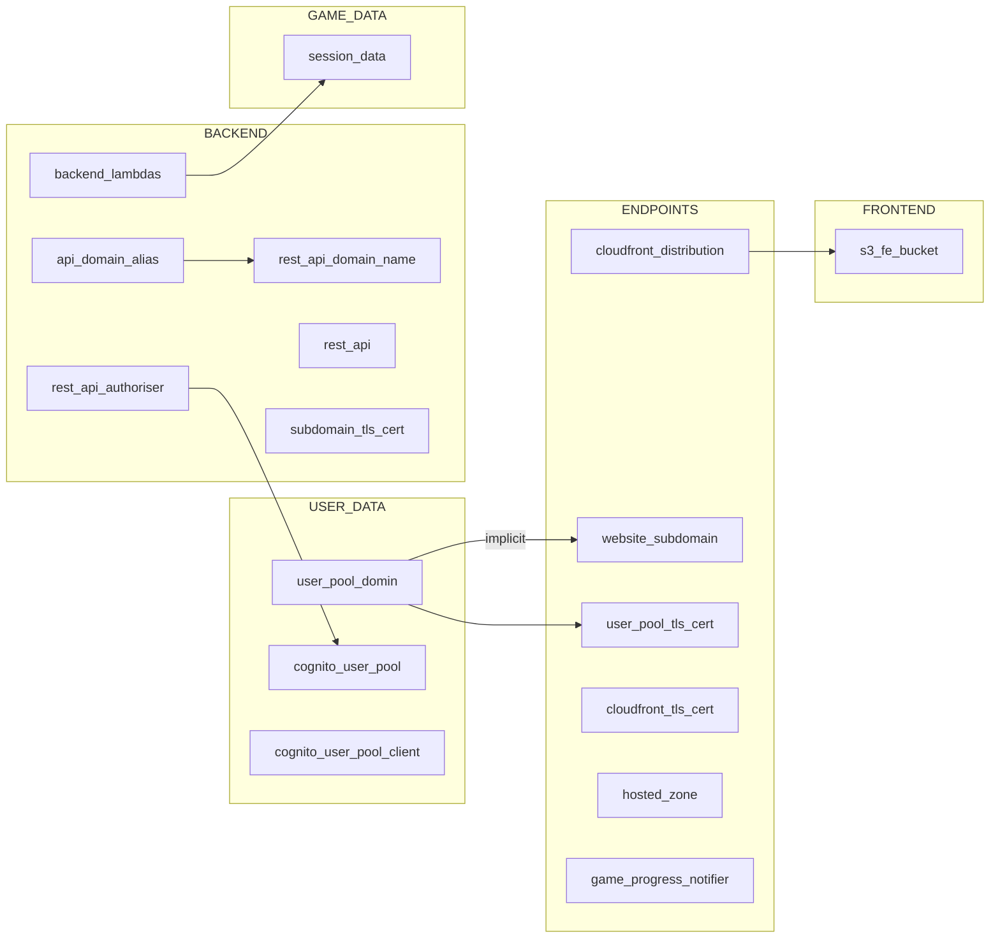

```mermaid
graph LR
    
    backend_lambdas-->session_data;
    api_domain_alias-->rest_api_domain_name;
    cloudfront_distribution-->s3_fe_bucket;
    user_pool_domin--implicit-->website_subdomain;
    user_pool_domin-->user_pool_tls_cert;
    rest_api_authoriser-->cognito_user_pool;

    subgraph ENDPOINTS
        cloudfront_tls_cert;
        hosted_zone;
        cloudfront_distribution;
        user_pool_tls_cert;
        website_subdomain;
        game_progress_notifier;
    end
    subgraph USER_DATA
        cognito_user_pool;
        cognito_user_pool_client;
        user_pool_domin;
    end
    subgraph BACKEND
        rest_api_authoriser;
        rest_api;
        rest_api_domain_name;
        backend_lambdas;
        api_domain_alias;
        subdomain_tls_cert;
    end
    subgraph GAME_DATA
        session_data;
    end
    subgraph FRONTEND
        s3_fe_bucket;
    end    
```

TODO: consider using https://diagrams.mingrammer.com/ for this graph (looks cooler)

Dependencies from cdk.out json files: by looking at Fn::ImportValue locations. I should automate this...